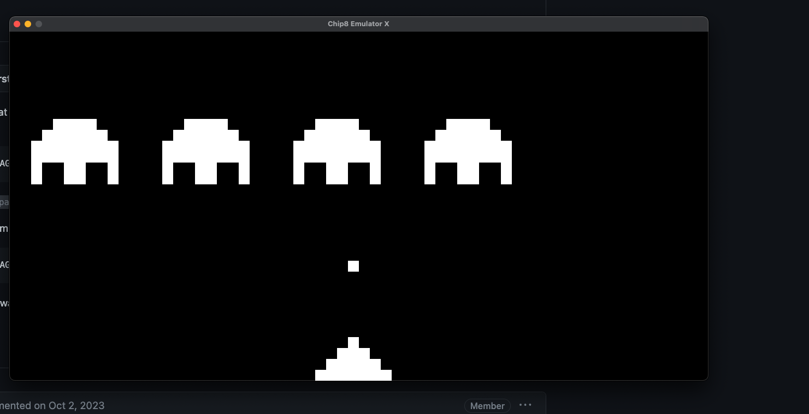

# Chip8 emulator

This is a chip 8 emulator written in C++ and SDL2. To run this, you have to download SDL2 library for your system 
and include it to your project, so that CMake can locate it.

After compiling, you also have to provide a game ROM to be run as `./main $(game_rom)`

There is unfixed synchronization issues with this program, but that wouldn't be a big problem.

